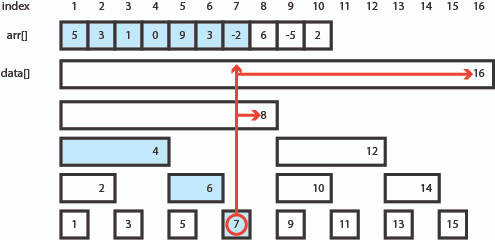

# 구간 합 구하기 4

문제 번호: 11659
작성일시: 2021년 12월 24일 오전 8:45

[구간 합 구하기](https://www.acmicpc.net/problem/11659)
# Solution

```python
class FenwickTree:
    data = []
    N = 0
    def __init__(self, arr):
        self.N = len(arr);
        self.data = [0] * (self.N + 1)
        for i in range(1, self.N+1):
            self.update(i, arr[i-1])
   
    # update
    def update(self, idx, diff):
        while idx <= self.N:
            self.data[idx] += diff
            idx = idx + (idx & -idx)
    
    # sum(index)
    def _sum(self, idx):
        ans = 0
        while idx > 0:
            ans += self.data[idx]
            idx = idx & (idx-1)
        return ans

    # sum(left, right)
    def sum(self, left, right):
        return self._sum(right) - self._sum(left-1)

N, M = map(int, input().split())
arr=  list(map(int, input().split()))
fenwick = FenwickTree(arr)
for _ in range(M):
    l, r = map(int, sys.stdin.readline().split())
    sys.stdout.write(str(fenwick.sum(l, r))+ '\n')
```

# FenwickTree

시간복잡도 : 초기화시 $O(N)$, 구간합 탐색시 $O(\log N)$

- 내부 변수는 배열이고 크기는 N+1로 설계한다. 편의상 1부터 인덱스 시작하기 위함
    - update(i, arr[i-1])
- update(index, diff)
    
    idx = idx + (idx & -idx)
    
    
    
- sum(index)
    
    idx = idx & (idx - 1)
    
    - 

[Python, Machine & Deep Learning](https://greeksharifa.github.io/algorithm%20&%20data%20structure/2018/07/09/algorithm-fenwick-tree/)

# 비트연산 꿀팁

- 가장 오른쪽의 1 비트 반환하기
    - **n & (-n)**
    - 음수의 경우 2의 보수 형태 즉 -A = ~A + 1
- 가장 오른쪽 1의 비트 제거하기
    - **n & n-1**