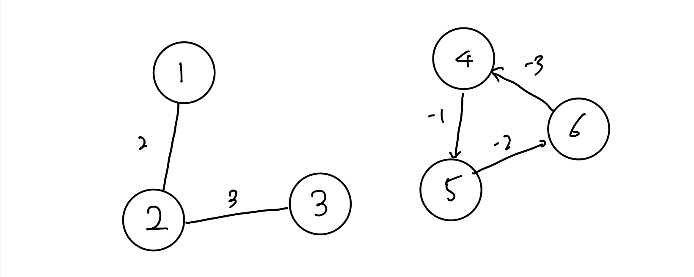

# 웜홀

URL: https://www.acmicpc.net/problem/1865
문제 번호: 1865
작성일시: 2022년 1월 1일 오후 4:45

[1865번: 웜홀](https://www.acmicpc.net/problem/1865)

# 솔루션

```python
class Solution:
    
    T:int
    N:int; M:int; W:int;
    edges = []
    INF = 10001
    # input 메서드
    def input_process(self):
        self.N, self.M, self.W = map(int, input().split())
        self.edges.clear()
        for _ in range(self.M):
            a, b, c = map(int, input().split())
            self.edges.append((a,b,c))
            self.edges.append((b,a,c))
        for _ in range(self.W):
            a, b, c = map(int, input().split())
            self.edges.append((a,b,-c))
    
    # Check NegativeCycle
    def bellman_ford(self, start):
        dist = [self.INF] * (self.N + 1)
        dist[start] = 0
        for i in range(self.N):
            for j in range(len(self.edges)):
                cur, next, cost = self.edges[j]
                if dist[next] > dist[cur] + cost:
                    dist[next] = dist[cur] + cost
                    if i == self.N-1:
                        return True
        return False

    def solve(self):
        self.T = int(input())
        for _ in range(self.T):
            self.input_process()
            negative_cycle = self.bellman_ford(1)
            if negative_cycle:
                print("YES")
            else:
                print("NO")

s = Solution()
s.solve()
```

문제에 음수의 간선이 포함되어있고 음수 사이클을 판별하는 문제이므로 벨만포트 알고리즘을 쓰면 된다. 하지만 이 문제의 경우 함정이 있다. 그래프가 끊어져 있을 수도 있다는 것이다. 그말은 만약 시작점이 음수 사이클 간선과 끊어져 있다면 기존의 벨만포트 알고리즘으로는 찾아 낼 수 없다.

벨만 포드 알고리즘의 경우 N 번 모든 간선 순회를 반복하는데 특정 조건을 만족할 경우 dist를 갱신한다. 특정 조건은 다음과 같다.

```python
if dist[cur] != INF and dist[next_node] > dist[cur] + cost
```

dist[cur] 은 값이 무한하면 안된다. 그 이유는 cur이 무한하면 거리를 갱신하는 것이 불확실해지기 때문이다. 그러나 이 문제의 경우는 다르다. 이 문제는 사이클 여부만 묻고 있고 그래프가 끊어진 경우도 존재한다. 이 때 cur ≠ inf 면 갈 수 없는 간선의 경우 사이클 체크를 수행하지 않는다. 그래서 다음과 같이 바꿔준다.

```python
if dist[next_node] > dist[cur] + cost
```

무한이 아니여도 조건을 수행해주면 된다.



예제로 쉽게 이해 가능하다.

step 1 = 0, inf, inf, inf ,inf, inf

step 2= 0, 2, inf, inf, inf, inf

step 3 = 0, 2, 5 inf, inf ,inf

기존의 경우 4 , 5, 6 간선이 붙은 경우는 탐색하지 않는다. 무한대이기 때문. 결국 시작점이 음수사이클을 포함하지 않으면 사이클을 찾을 수 없다.

후자의 경우

step 4= 0 , 2, 5 , inf, inf -1, inf

step 5 = 0, 2, 5, inf, inf-1, inf - 3

이런식으로 무한대보다 작은 무한대가 형성된다. 결국 최종적으로 비교할 때 이 값들이 갱신되면 이것보다 작은 거리를 갱신한다는 것은 사이클이 있다는 증거가 되므로 음수 사이클을 알 수 있다.

<aside>
💡 주의점: 파이썬의 경우 math.inf를 쓰지 말 것..

</aside>

math.inf == math.inf-1 이기 때문에 이 알고리즘이 제대로 동작하지 않는다.

inf와 inf -1 이 구분 되어야 알고리즘을 성공적으로 수행 할 수 있기 때문이다.

1. 벨만포트 사용시 무한대는 임의로 지정해주자.(math.inf, float(’inf’) 사용 금지)
2. 끊어진 사이클을 찾는 방법은 2가지가 있다.
    1. 모든 시작 지점에서 벨만포트를 수행한다.
    2. 정확한 거리가 중요치 않다면 dist[curr]=inf 여도 벨만포트를 수행한다.